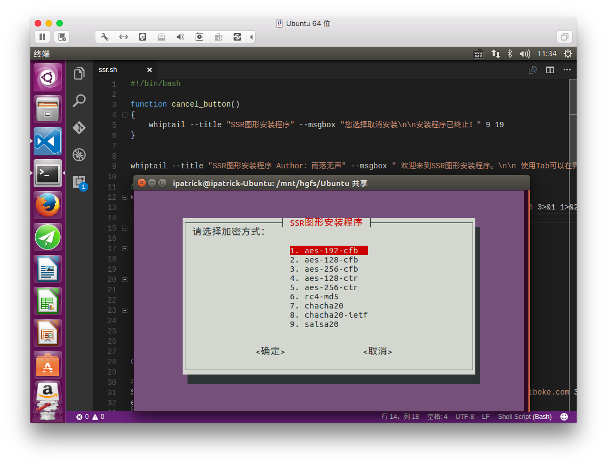

# GUInstaller-For-SSR
一个图形化SSR安装脚本，可视化安装SSR的辅助脚本。

## 简介
个人利Whiptail开发的SSR一键安装包，图形化安装SSR。这只是个人第一次尝试Linux交互Shell的小作品，内写了大量的注释以供学习研究。不建议使用在生产环境。目前版本仅供娱乐使用。

## 缺点
- 不支持开机启动
- 出错无法根据日志来排除错误

## 系统支持
- Ubuntu 14
- Ubuntu 16
- CentOS 6
- CentOS 7
- Debian 7
- Debian 8

## 安装脚本
    wget -N --no-check-certificate https://raw.githubusercontent.com/FunctionClub/GUInstaller-For-SSR/master/install.sh && bash install.sh

## 截图
